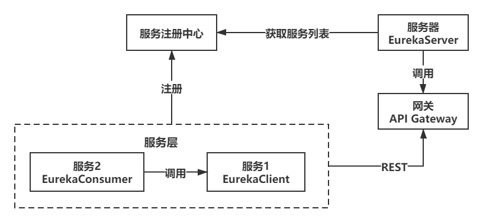
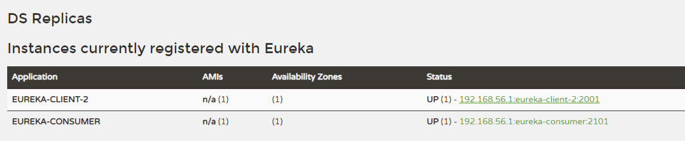
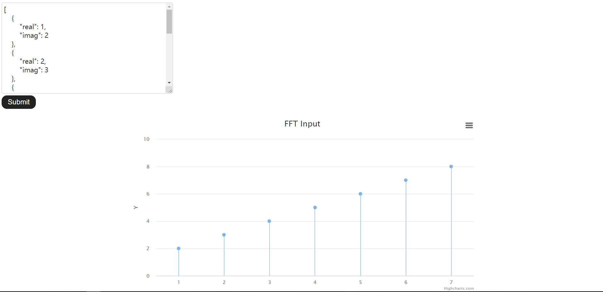
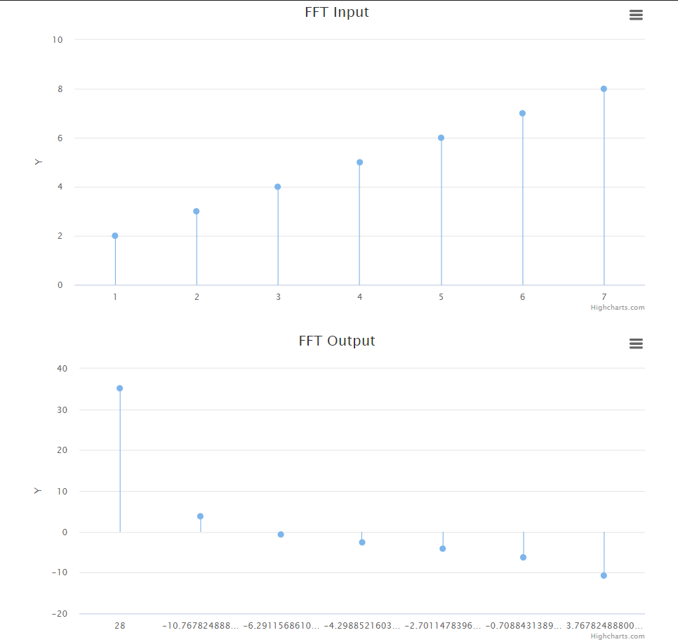
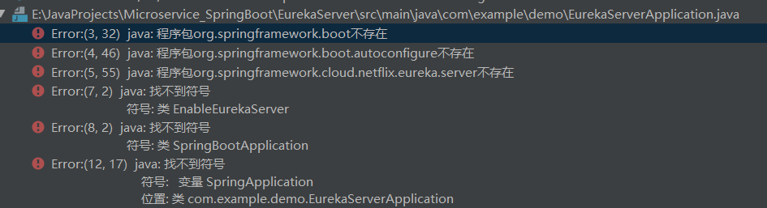

*src: http://blog.didispace.com/spring-cloud-learning/*

## Spring Cloud Eureka

架构图如下：



首先，我们来尝试使用Spring Cloud Eureka来实现服务治理。

Spring Cloud Eureka是Spring Cloud Netflix项目下的服务治理模块。而Spring Cloud Netflix项目是Spring Cloud的子项目之一，主要内容是对Netflix公司一系列开源产品的包装，它为Spring Boot应用提供了自配置的Netflix OSS整合。通过一些简单的注解，开发者就可以快速的在应用中配置一下常用模块并构建庞大的分布式系统。它主要提供的模块包括：服务发现（Eureka），断路器（Hystrix），智能路由（Zuul），客户端负载均衡（Ribbon）等。

`EurekaServer`：服务注册中心



`EurekaClient`：服务提供方，其中使用`Spring Cloud Feign`使得编写Web服务客户端变得更加简单。我们只需要通过创建接口并用注解来配置它既可完成对Web服务接口的绑定。

`EurekaConsumer`：服务消费者，访问服务提供方的接口*（即在微服务内部调用`Client`的接口）*， 其中使用`Spring Cloud Ribbon`进行负载均衡，它是一个基于HTTP和TCP的客户端负载均衡器。它可以通过在客户端中配置ribbonServerList来设置服务端列表去轮询访问以达到均衡负载的作用。 

将FFT接口配置在`EurekaClient`中，通过`EurekaConsumer`的端口进行调用，通过Highcharts提供的API进行图表绘制。

输入数据为：

```json
[
    {
        "real": 1,
        "imag": 2
    },
    {
        "real": 2,
        "imag": 3
    },
    {
        "real": 3,
        "imag": 4
    },
    {
        "real": 4,
        "imag": 5
    },
    {
        "real": 5,
        "imag": 6
    },
    {
        "real": 6,
        "imag": 7
    },
    {
        "real": 7,
        "imag": 8
    }
]
```

运行结果为：





### 添加服务网关

我们使用Spring Cloud Netflix中的Eureka实现了服务注册中心以及服务注册与发现；而服务间通过Ribbon或Feign实现服务的消费以及均衡负载；*通过Spring Cloud Config实现了应用多环境的外部化配置以及版本管理。为了使得服务集群更为健壮，使用Hystrix的融断机制来避免在微服务架构中个别服务出现异常时引起的故障蔓延* 

服务网关是微服务架构中一个不可或缺的部分。通过服务网关统一向外系统提供REST API的过程中，除了具备服务路由、均衡负载功能之外，它还具备了权限控制等功能。Spring Cloud Netflix中的Zuul就担任了这样的一个角色，为微服务架构提供了前门保护的作用，同时将权限控制这些较重的非业务逻辑内容迁移到服务路由层面，使得服务集群主体能够具备更高的可复用性和可测试性。 

`ApiGateway`：通过`zuul`实现一个对外部开放的API网关，同时可以配置路由。

---

### 发现问题：

1. 服务发现的加载速度不是在服务器启动的瞬间就完成的

2. 在`Consumer`使用的URL路径需要和`Client`中保持一致，否则即使运行成功也无法调用

3. 

   所有jar包导入正常还有这个错误，在路径下运行指令`mvn idea:idea`

   但是这样的话每次重启IDEA都要执行一次，而博客`https://blog.csdn.net/liudun_cool/article/details/106106982`中的思路值得借鉴，将IDEA编译方式变成Maven构建，因为IDEA的Build（编译）操作和Maven的Build是分开的 。

